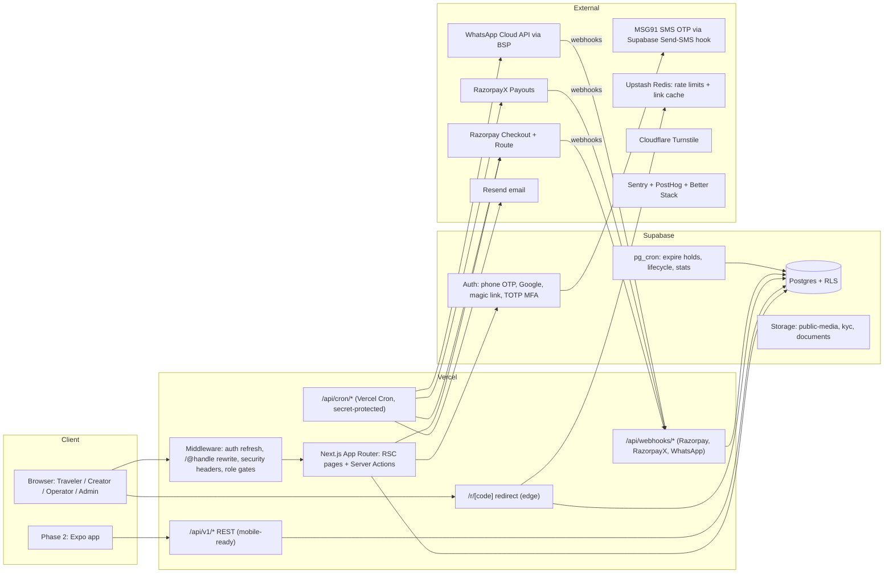
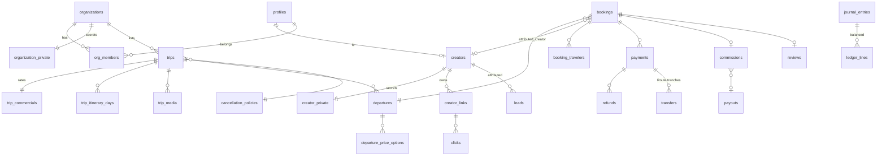
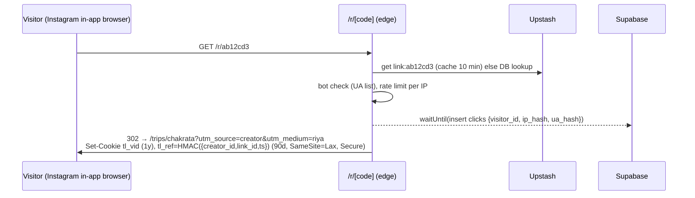

# TripLink — Phase 1 Architecture (Web)

> **Working name:** TripLink. Swap it everywhere once you've chosen the brand.
> **What it is (v2, Sep 2026):** **"Wishlink for travel"** — a travel affiliate platform. Operators list trips and set commissions; Instagram creators (1,000+ followers, verified via Instagram Login) pick trips, get tracked affiliate links for their reels and stories, and earn on the leads and bookings they drive; operators see every click, lead and booking per creator and link. **§20 is the v2 spec and overrides earlier sections where they conflict.**
> **What it was (v1):** a creator-led travel marketplace. Operators list group, experiential and package trips. Creators share tracked links and storefronts. Travelers book and pay on TripLink. Operators get paid through Razorpay Route, creators get commission through RazorpayX, and the platform keeps a fee.
> **Stack:** Next.js (App Router) on **Vercel** · **Supabase** (Postgres, Auth, Storage, pg_cron) · Razorpay (Checkout + Route + RazorpayX).
> **Companion files:** `supabase/migrations/20261001000000_init.sql` (full schema, RLS, core functions, tested) · `AGENTS.md` (rules for your AI coding tool) · `.env.example`.

---

## 0. How to use this doc when vibe coding

1. Put `ARCHITECTURE.md`, `AGENTS.md` and the migration in the repo root **before** writing code. Point Cursor, Claude Code or Lovable at them.
2. Build in the milestone order in **§17**. Each milestone has acceptance criteria, so don't start the next until the current one passes.
3. The rules in **§8 Security** and **§7 Money** are non-negotiable. Anything that touches money, RLS or webhooks gets reviewed by a human (you) line by line.
4. Items marked ⚠️ **CA** need sign-off from a chartered accountant. Items marked ⚠️ **VERIFY** are vendor behaviour to confirm in their docs or sandbox.

### Phase 1 decisions (locked)
| Decision | Choice | Why |
|---|---|---|
| Who collects money | **Platform** (Razorpay Checkout) with Route split to operators | Attribution comes from the payment, so operators can't bypass you. Refunds and commissions are enforceable. |
| Legal seller | **Operator** (merchant of record for the trip). Platform is a marketplace / e-commerce operator (ECO) | Keeps package GST on the operator. The platform's GST is 18% on its fee only. |
| Geography | **Domestic trips only** | Avoids overseas-package TCS in Phase 1 |
| Attribution | Last creator touch within **90 days**. A creator code at checkout overrides it. Locked when the booking is created | Travel has a long consideration cycle |
| Commission earned | On trips that actually happen, or once the booking becomes non-refundable | Protects against cancellations |
| Creator payouts | Monthly (5th), 2% TDS, maker-checker approval | Compliance and fraud control |
| Operator payouts | Route transfers **on hold**, released in tranches (50% at T-7 days, 50% at end+2 days) | Operators get cash to run the trip. You keep refund cover |
| Mobile | Phase 2 (Expo/React Native) reuses `/api/v1` | Build the API cleanly now |
| **Booking mode (v2)** | **Per trip:** `platform` (book + pay on TripLink, as in §6.2) or `redirect` / `enquiry` (traffic goes to the operator; operator reports bookings). See §20.3 | Operators without payment integration can join on day one; platform mode keeps perfect tracking |
| **Creator earnings (v2)** | % commission on confirmed bookings **plus** an optional fixed fee per qualified lead, set by the operator per trip. See §20.4 | Rewards creators when travelers book later or offline |
| **Creator gate (v2)** | Instagram Professional account connected via Instagram Login; **≥ 1,000 followers** to get links (`app_settings.creator.min_followers`). See §20.2 | Quality bar + automatic verification |

---

## 1. Product scope — Phase 1

### Roles
| Role | Who | How they sign in |
|---|---|---|
| **Traveler** | Books trips | Phone OTP (primary), Google, email magic link |
| **Creator** | Instagram/YouTube creators who promote trips | Phone OTP + Instagram handle; KYC (PAN + bank/UPI) before payout |
| **Operator** (org) | Travel companies (Travel Devils first). Multi-user: owner / manager / staff | Email + password or OTP; **MFA required for owner/manager** |
| **Admin** | You and your team: `super_admin`, `ops`, `finance`, `support` | Email + **mandatory TOTP MFA** (aal2) |

### Features by surface
**Public site (SEO + conversion)**
- Home, search/browse (destination, month, budget, duration, trip type), destination pages
- Trip page: gallery, itinerary by day, inclusions and exclusions, departures with seats left, price options (triple/double sharing), pickup points, cancellation policy, operator card (rating; **no phone or email until booked**), reviews, "Hosted by @creator" badge
- Creator storefront `/@handle`: bio, socials, their curated trips, upcoming hosted trips
- WhatsApp enquiry button that goes to **the platform's** WhatsApp number with a ref code
- Static pages: About, How it works (creators / operators), Terms, Privacy, Refund policy, Grievance officer, Contact

**Traveler account**
- My bookings (status, pay balance, invoices, cancel request, traveler details), wishlist, reviews, support tickets, profile, data export/delete request

**Checkout**
- Choose departure → price option → traveler count → pickup → traveler details → optional coupon or creator code → pay deposit or full amount (Razorpay) → confirmation with booking ref, invoice, and a WhatsApp and email confirmation

**Creator dashboard**
- Onboarding (profile, Instagram handle, agreement, KYC: PAN + UPI/bank)
- Trip catalogue with your commission shown per trip, filters, "Get link" (short link, QR, WhatsApp share text, caption template)
- Links manager (label per reel or story, per-link stats)
- Storefront editor (pick and order trips, bio, cover)
- Earnings: pending → confirmed → payable → paid, per booking (no traveler PII)
- Payouts: history, statements, TDS summary per financial year
- Analytics: clicks, unique visitors, leads, bookings, conversion rate, GMV, by day and by link
- Hosted trips (tier `host`): trips they lead and bookings on them

**Operator dashboard**
- Onboarding: company details, GSTIN, GST scheme (5% no ITC / 18% with ITC), KYC documents, bank → Razorpay Route linked account, operator agreement
- Trips: create/edit (itinerary builder, media upload, inclusions, policy picker, commission %), submit for review, pause/unpause
- Departures: calendar, capacity, price options, deposit, balance due days, booking cutoff
- Bookings: list and detail (traveler list and contacts **after** confirmation), manifest CSV export, mark no-show
- Settlements: transfers by tranche and status, monthly commission invoices from the platform
- Reviews: reply to reviews
- Team: invite members, roles

**Admin console**
- Approvals queue: operators (KYC), creators, trips (content and quality review)
- Bookings: search by ref, phone or email; manual cancel and refund; change departure
- Leads inbox (WhatsApp and web enquiries): assign, send payment link, mark converted
- Commissions: holds (fraud flags), manual reversal with reason
- Payout runs: generate → review → **approve by a different admin** → execute → reconcile
- Settlements: transfer status, release or hold overrides
- Coupons, cancellation policies, app settings
- Reviews moderation, support tickets, data requests (DPDP)
- Audit log viewer (super_admin)

### Out of scope for Phase 1 (don't let the AI build these)
International trips · hotel-only or flight bookings · EMI/BNPL · in-app chat between traveler and operator · native apps · multi-currency · creator-to-creator referrals · ~~automated Instagram follower verification~~ (now in scope, §20.2) · Instagram DM automation / auto-reply to comments (Wishlink "Engage"; Phase 2) · dynamic pricing · operator channel-manager integrations.

---

## 2. System architecture



### Components and responsibilities
| Component | Responsibility | Notes |
|---|---|---|
| **Next.js RSC pages** | All UI. Reads through the Supabase server client **as the user** (RLS applies) | Public pages use ISR (see §13) |
| **Server Actions** | Mutations from web forms (create trip, update profile, create link) | Each one: authenticate → authorize → validate with zod → call a domain service |
| **`/api/v1` route handlers** | Same domain services, exposed as JSON for the Phase 2 mobile app. Auth by `Authorization: Bearer <supabase access token>` | Versioned; documented in `docs/api.md` |
| **Domain services** (`lib/domain/*`) | **All** business logic: pricing, attribution, booking, cancellation, commission, settlement, payouts, ledger | Pure TypeScript and unit-tested. Never inside components |
| **Admin client** (`lib/supabase/admin.ts`) | Service-role client for money tables, webhooks and cron. `import 'server-only'` | Never imported from client code. ESLint rule enforces it |
| **Webhooks** | Verify the signature → store in `webhook_events` (idempotent) → process → mark processed | Always return 200 quickly after storing; retries are safe |
| **Cron** | External-API jobs (payouts, transfer sync, reminders, outbox) | Vercel Cron → route handlers protected by `CRON_SECRET` |
| **pg_cron** | Pure-DB jobs: expire holds (every minute), lifecycle (daily), stats rollup (every 15 min) | Already written in the migration |
| **Outbox** | Durable side-effects (notifications, analytics, invoice PDFs) written inside the same transaction as the state change | Processed every minute; exponential backoff |

---

## 3. Tech stack

| Layer | Choice | Notes |
|---|---|---|
| Framework | **Next.js (latest stable, App Router)**, TypeScript `strict` | React Server Components by default; `"use client"` only where needed |
| UI | Tailwind CSS + **shadcn/ui** + lucide icons; `react-hook-form` + `zod` | Mobile-first: most traffic comes from Instagram's in-app browser |
| DB/Auth/Storage | **Supabase** (Pro plan at launch: PITR backups, no pausing) | `@supabase/ssr` for cookies; generated types via `supabase gen types` |
| Hosting | **Vercel** (Pro: cron frequency, team, firewall) | Region: `bom1` (Mumbai) for functions; Supabase region `ap-south-1` |
| Payments | **Razorpay** Checkout + Orders API + **Route** (linked accounts, transfers, on_hold) + **RazorpayX** (payouts to creators) | ⚠️ VERIFY Route activation for a travel marketplace, max `on_hold` duration, fees |
| Messaging | **WhatsApp Cloud API** through a BSP (Interakt, AiSensy or Gupshup). Template messages | Needs Meta business verification (1–2 weeks). Start early |
| SMS OTP | **MSG91** (DLT-registered template) via Supabase **Send SMS Hook** | Indian DLT rules require a registered sender ID and template |
| Email | **Resend** + `react-email` templates | Domain SPF/DKIM/DMARC |
| Rate limiting / cache | **Upstash Redis** (`@upstash/ratelimit`) | OTP, login, checkout, link redirects, lead forms |
| Bot protection | **Cloudflare Turnstile** on signup, lead and checkout forms; Vercel Firewall / Bot protection | |
| PDFs | `@react-pdf/renderer` (invoices, statements, manifests) | Generated server-side into the `documents` bucket |
| Search | Postgres full-text (`tsvector`) + `pg_trgm` for fuzzy matching | Move to Typesense or Algolia only when you pass about 5k trips |
| Images | Supabase Storage + Next `<Image>` with a custom loader (Supabase image transformations) | WebP/AVIF, max 10 MB upload, resized on read |
| Monitoring | **Sentry** (errors + performance), **PostHog** (product analytics, funnels, feature flags), **Better Stack** (uptime + log drain) | |
| Testing | **Vitest** (domain unit tests), **pgTAP** or SQL tests for RLS, **Playwright** (e2e checkout in Razorpay test mode) | |
| CI | GitHub Actions: typecheck, lint, unit, RLS tests, build; Vercel preview per PR | |

**Monthly cost at launch (approx.):** Vercel Pro $20 · Supabase Pro $25 (+compute) · Upstash, Sentry, PostHog, Resend on free tiers · WhatsApp per conversation (roughly ₹0.1–0.8 each) · MSG91 about ₹0.2/SMS · Razorpay about 2% per transaction. **Roughly ₹5–8k/month before scale.**

---

## 4. Repository structure

```
/
├─ ARCHITECTURE.md  AGENTS.md  .env.example
├─ app/
│  ├─ (public)/
│  │  ├─ page.tsx                      # home
│  │  ├─ trips/page.tsx                # search/browse
│  │  ├─ trips/[slug]/page.tsx         # trip detail (ISR)
│  │  ├─ destinations/[slug]/page.tsx
│  │  ├─ c/[handle]/page.tsx           # creator storefront (served at /@handle via middleware rewrite)
│  │  ├─ for-creators/ for-operators/ legal/[doc]/
│  ├─ r/[code]/route.ts                # tracked redirect (edge runtime)
│  ├─ (auth)/login/ signup/ mfa/ callback/route.ts
│  ├─ checkout/[bookingId]/page.tsx
│  ├─ account/                         # traveler
│  │  ├─ bookings/ bookings/[ref]/ wishlist/ support/ profile/ privacy/
│  ├─ creator/                         # creator dashboard (role-gated)
│  │  ├─ onboarding/ trips/ links/ storefront/ earnings/ payouts/ analytics/ hosted/ settings/
│  ├─ operator/                        # operator dashboard (org-gated)
│  │  ├─ onboarding/ trips/ trips/[id]/ departures/ bookings/ settlements/ reviews/ team/ settings/
│  ├─ admin/                           # aal2 required
│  │  ├─ approvals/ bookings/ leads/ commissions/ payouts/ settlements/ coupons/ reviews/ support/ settings/ audit/
│  ├─ api/
│  │  ├─ v1/…                          # REST for mobile (see §9)
│  │  ├─ webhooks/razorpay/route.ts
│  │  ├─ webhooks/razorpayx/route.ts
│  │  ├─ webhooks/whatsapp/route.ts
│  │  └─ cron/[job]/route.ts
│  ├─ sitemap.ts  robots.ts  layout.tsx  error.tsx  not-found.tsx
├─ components/ (ui/ = shadcn, trip/, checkout/, dashboard/, admin/)
├─ lib/
│  ├─ supabase/ server.ts  client.ts  admin.ts(server-only)  middleware.ts
│  ├─ auth/ guards.ts (requireUser, requireCreator, requireOrgRole, requireAdmin(aal2))
│  ├─ domain/
│  │  ├─ pricing.ts        # quote(): subtotal, discount, GST, total, deposit
│  │  ├─ attribution.ts    # resolveAttribution(): cookie, code, lead, phone match
│  │  ├─ booking.ts        # createHold, confirmPayment, payBalance, changeDeparture
│  │  ├─ cancellation.ts   # computeRefund(policySnapshot, booking, today)
│  │  ├─ commission.ts     # computeCommission, reverse, fraud checks
│  │  ├─ settlement.ts     # computeTransfers (tranches, fees, TCS/TDS)
│  │  ├─ payouts.ts        # buildPayoutRun, TDS by FY, execute
│  │  ├─ ledger.ts         # journal recipes (§7.4)
│  │  └─ money.ts          # paise helpers, rounding (banker's rounding NOT used; round half up, documented)
│  ├─ integrations/ razorpay.ts razorpayx.ts whatsapp.ts resend.ts msg91.ts turnstile.ts
│  ├─ security/ ratelimit.ts crypto.ts(AES-GCM for PAN) cookies.ts(HMAC-signed ref) audit.ts headers.ts
│  ├─ validation/ *.ts (zod schemas shared by actions + API)
│  ├─ outbox/ enqueue.ts handlers/*.ts
│  └─ utils/
├─ emails/ (react-email templates)
├─ supabase/ config.toml  migrations/  seed.sql  tests/ (pgTAP RLS tests)
├─ tests/ unit/ e2e/
└─ middleware.ts
```

> ⚠️ Next.js treats folders starting with `@` as parallel routes. Serve storefronts at `/c/[handle]` and **rewrite `/@handle` → `/c/handle`** in `middleware.ts`.

---

## 5. Data model

The full DDL, RLS and functions are in `supabase/migrations/20261001000000_init.sql`. It has been tested: seat holds can't oversell, unbalanced journals are rejected, anonymous users can't read commission rates or bookings, creators can't read bookings, operators can't self-publish or edit seat counters, and reviews require a completed booking.



### Key modelling rules
- **Money = `bigint` paise.** Never `numeric` for amounts and never JS floats. Percentages are `numeric(5,2)`, applied once in `money.ts` and rounded half-up to the paisa.
- **Public/private split.** `creators` and `organizations` are publicly readable. PAN, payout references and the Route account ID live in `creator_private` and `organization_private` (owner and admin only). PAN is **encrypted at the app layer** (AES-256-GCM, key in the `PII_ENCRYPTION_KEY` env var). Only `pan_last4` is shown.
- **Commercials split.** `trip_commercials` (commission %) is visible to active creators, the org and admins, never to anonymous users.
- **Snapshots.** A booking stores the price, GST rate, commission %, platform fee %, cancellation policy JSON and attribution **at creation**. Later edits to a trip never change existing bookings.
- **Denormalized commissions.** A commission row carries `booking_ref`, `trip_title`, `departure_start` and `travelers_count`, so creators **never** need to read `bookings` (which hold traveler PII).
- **Seat counters** change only through `hold_seats`, `confirm_seats`, `release_held_seats` and `release_booked_seats` (atomic conditional UPDATE, so no overselling). A trigger blocks direct edits.
- **Append-only:** `journal_entries`, `ledger_lines` and `audit_logs` (triggers block UPDATE and DELETE).
- **Status guards:** triggers stop operators and creators changing privileged fields (publish status, platform fee, tier, KYC status, referral code).

### State machines
```
Trip:       draft → pending_review → published ⇄ paused → archived
                          ↘ rejected → (edit) → pending_review
Departure:  open → sold_out ⇄ open → closed (cutoff) → completed | cancelled
Booking:    held ──(payment captured)──▶ confirmed ──(balance paid / full)──▶ paid_in_full ──(end date)──▶ completed
              └─(15 min)─▶ expired        └──────────────▶ cancelled ◀─────────────┘
Commission: pending ──(confirmable_at & booking alive)──▶ confirmed ──(completed + payable_at)──▶ payable
              │                                                                   └─▶ in_payout ─▶ paid
              ├─▶ reversed (booking cancelled before confirmation)
              └─▶ on_hold (fraud flag; admin resolves)
Payout:     draft ─▶ approved (2nd admin) ─▶ processing ─▶ processed | failed ─▶ (retry) 
Transfer:   created ─▶ on_hold ─▶ released ─▶ settled   (or reversed / partially_reversed)
```

---

## 6. Core flows

### 6.1 Tracked link click and attribution

**Attribution resolution** (`lib/domain/attribution.ts`), run once when the booking hold is created. First match wins:
1. **Creator code** typed at checkout (`creators.referral_code`, must be an active creator) → `source=code`.
2. **Lead** linked to this checkout (from the WhatsApp or payment-link flow) → `source=whatsapp`.
3. **`tl_ref` cookie** with a valid HMAC, not older than `attribution_window_days` (90) → `source=link` or `storefront`. Last click wins because each new click overwrites the cookie.
4. **Phone match**: a lead with the same `contact_phone` in the last 90 days that has a creator → `source=phone_match`.
5. Otherwise no creator. The platform keeps the creator's share as extra margin; don't pass it to the operator.

Then run the **fraud checks** (§8.6). On a flag, the commission is created with `status=on_hold`.
Store `attributed_creator_id`, `attribution_link_id`, `attribution_source`, `attribution_visitor_id` and `creator_commission_pct` (from `commission_overrides` if valid, then the host rate if this is the creator's hosted departure, else `trip_commercials.creator_commission_pct`) **on the booking**. These values never change after that.

### 6.2 Checkout and payment
```mermaid
sequenceDiagram
  participant T as Traveler
  participant S as Server Action
  participant DB as Postgres
  participant RZ as Razorpay
  participant W as /api/webhooks/razorpay
  T->>S: createHold(departure, option, qty, pickup, travelers, coupon/code)
  S->>S: zod validate, rate limit, Turnstile, require login (OTP)
  S->>DB: hold_seats(dep, qty)  (false → "sold out")
  S->>S: pricing.quote() + attribution.resolve()
  S->>DB: insert bookings(status=held, hold_expires_at=now+15m, snapshots)
  S->>RZ: orders.create({amount: deposit|total, receipt: booking_ref, notes:{booking_id}})
  S->>DB: insert payments(created, order_id)
  S-->>T: open Razorpay Checkout (order_id, key_id, prefill)
  T->>RZ: pays (UPI/card/netbanking)
  RZ-->>T: handler(payment_id, order_id, signature)
  T->>S: verifyPayment() → HMAC check → show "processing" (do NOT confirm here)
  RZ->>W: payment.captured (source of truth)
  W->>W: verify X-Razorpay-Signature over raw body; insert webhook_events(id) ON CONFLICT DO NOTHING
  W->>DB: tx: payment=captured, amount check == expected, booking=confirmed|paid_in_full,<br/>confirm_seats(), create commission(pending), post_journal(payment_captured), outbox(booking.confirmed)
  W->>RZ: create Route transfers (tranches, on_hold=1, on_hold_until)  (via outbox, idempotent)
  W-->>RZ: 200
```
**Rules**
- The price is **always recomputed on the server** from DB rows. The client sends IDs and quantities only.
- Confirm **only from the webhook** (`payment.captured`). The client handler just polls booking status.
- If a webhook arrives for an **expired** hold, try `hold_seats` again. If that fails (sold out), auto-refund in full and notify the traveler and ops.
- Configure Razorpay orders with **auto-capture** (payment_capture=1).
- The amount captured must equal `payments.amount_paise`. On a mismatch, flag it, don't confirm, and alert.
- Webhook events to handle: `payment.captured`, `payment.failed`, `order.paid`, `refund.processed`, `refund.failed`, `transfer.processed`, `transfer.failed`, `settlement.processed`. RazorpayX: `payout.processed`, `payout.failed`, `payout.reversed`.

### 6.3 Deposit and balance
- If `departures.deposit_per_person_paise > 0`, the traveler chooses **deposit** or **full**. `balance_due_date = start_date - balance_due_days_before`.
- Reminders go out by WhatsApp and email at due−7, due−3 and due−1 days (cron plus outbox), with a link to `/account/bookings/[ref]` → "Pay balance" → new Razorpay order `kind=balance`.
- Unpaid after the due date: the booking is flagged in the admin "Overdue balances" queue. Phase 1 = **manual** decision (extend, or cancel under the policy). Don't auto-cancel yet.

### 6.4 Cancellation and refund (`lib/domain/cancellation.ts`)
```
days_before = start_date - today (IST)
rule        = first rule in policy_snapshot.rules where days_before >= min_days_before
retained    = round(total_paise * (100 - rule.refund_pct) / 100)
if deposit_non_refundable: retained = max(retained, deposit_paise)
refund      = max(0, amount_paid_paise - amount_refunded_paise - retained)
```
- **Traveler cancels** (from the account page; confirm dialog shows the refund amount) → Razorpay refund on the captured payment(s), newest first, with `reverse_all` on the Route transfers (proportional reversal ⚠️ VERIFY). Then `release_booked_seats`, booking=`cancelled`, commission → `reversed` if still `pending` (after confirmation, the creator keeps it because the trip value was retained), journal entries, notifications.
- **Operator cancels a departure** → admin-only action → 100% refund to every booking, all commissions reversed, the operator's reliability score is logged, and the travelers get a rebook offer.
- **Admin override**: goodwill refund with a mandatory reason (audited).
- Refunds only go back to the **original payment method** (RBI rule). Never refund to a different account.

### 6.5 Commission lifecycle
| Event | Effect |
|---|---|
| Payment captured | `commissions` row: `base = taxable_paise`, `amount = round(base × pct/100)`, `status=pending` (or `on_hold` if flagged), `confirmable_at = start_date − policy.zero_refund_within_days`, `payable_at = end_date + 3 days` |
| Daily `advance_lifecycle()` | pending → **confirmed** once `confirmable_at` has passed and the booking is alive; confirmed → **payable** once the booking is `completed` and `payable_at` has passed |
| Cancel before confirmed | → `reversed` (reason stored) |
| Monthly payout run | payable → `in_payout` → `paid` |
| Fraud review | `on_hold` → admin sets `pending` (valid) or `reversed` |

The creator dashboard shows each bucket with the date it moves next ("Confirms on 12 Nov · Payable after 21 Nov").

### 6.6 Operator settlement (Route)
On `payment.captured`, compute the **operator share of this payment** (§7) and create **transfers split into tranches** according to `organization_private.settlement_policy`:
- Tranche 1 (50%): `on_hold_until = start_date − 7`
- Tranche 2 (50%): `on_hold_until = end_date + 2`
- If the release date is already past (a last-minute booking), release straight away.

A daily cron syncs transfer status. Admins can extend a hold if there are complaints about a trip. ⚠️ VERIFY: Route's maximum on_hold period and whether `on_hold_until` can be modified. If there's a limit, set `on_hold=1` with no date and release through the API on schedule from your cron.

### 6.7 Creator payouts (RazorpayX)
1. **Cron on the 5th (IST)** → `buildPayoutRun()`: for each creator with KYC `approved` and a fund account, sum the `payable` commissions ≥ `min_payout_paise`.
2. **TDS** (⚠️ CA): track the creator's gross commission for the FY. When the FY total crosses the ₹20,000 threshold, deduct 2% on the whole payout (including the part that caused the crossing), and 2% on every later payout. No PAN means a higher rate. Block payout until PAN is verified.
3. Create `payouts(status=draft)` rows and mark the commissions `in_payout` → the admin (finance) reviews them → a **different** admin approves (enforced by a DB check) → execute RazorpayX payouts with an `idempotency key = payout.id` → webhook → `processed` (store UTR) or `failed` (commissions go back to `payable`, and the creator is told to fix their bank or UPI).
4. Journal: Dr creator_payable, Cr razorpay_clearing (net), Cr it_tds_commission_payable (TDS).
5. Generate a PDF statement per creator. Quarterly TDS certificates are produced by your CA from the export.

### 6.8 WhatsApp lead flow (the channel Indian travel actually closes on)
1. The trip page's "Chat on WhatsApp" opens `wa.me/<PLATFORM_NUMBER>?text=Hi! I'm interested in Chakrata Weekend (ref: ab12cd3)`, with the ref taken from the `tl_ref` cookie or link code.
2. The WhatsApp webhook receives the message → parses `ref:` → upserts a `lead` (phone, creator, trip) → auto-reply template with the trip link and "Talk to an expert".
3. Ops (admin leads inbox) chats with the lead, then creates a **payment link**: `/checkout/new?lead=<id>&departure=…` (signed, 48h expiry) → the booking inherits the lead's attribution.
4. Operators **never** get the lead's phone before booking. That's the defence against bypass.

### 6.9 Onboarding and KYC
- **Operator:** signup → create org (server action creates the org, owner membership and the private row in one transaction) → profile → GST scheme → upload PAN, GST certificate and cancelled cheque (kyc bucket) → accept agreement (consents row) → **admin review** → server creates the **Razorpay Route linked account** + stakeholder + product config (⚠️ VERIFY current Route linked-account v2 API) → `org.status=active`.
- **Creator:** phone OTP → handle + Instagram → agreement → PAN + name as on PAN + UPI or bank → server creates the RazorpayX contact and fund account (validate by penny-drop/VPA validation) → admin approves (checks the Instagram profile manually in Phase 1) → `status=active`. Creators can generate links once they're active. KYC is needed only before **payout**, so they can start promoting before their KYC is done.
- **Traveler:** phone OTP at checkout (no separate signup step, to cut drop-off).

---

## 7. Money and tax math

⚠️ **CA: every rate and treatment in this section must be confirmed by your CA before launch.** Store rates in `app_settings.tax` and never hardcode them.

### 7.1 Price build-up (per booking)
```
subtotal     = unit_price × travelers + pickup extras            (operator's price, excl. GST)
discount     = coupon (platform- or operator-funded)
taxable      = subtotal − discount
gst          = taxable × (5% if operator on gst5_no_itc else 18%)
total        = taxable + gst            (+ overseas TCS = 0 in Phase 1)
```
The trip page shows the price **"+ GST"** or GST-inclusive consistently. Pick one (GST-inclusive is better for conversion; still store both).

### 7.2 Split of what the traveler paid
```
creator_commission = taxable × creator_pct              (0 if no creator; platform keeps it)
platform_fee       = taxable × platform_fee_pct
service_fee        = creator_commission + platform_fee  (platform invoices operator)
gst_on_fee         = service_fee × 18%
gst_tcs            = taxable × 0.5%                      (ECO collects under GST Sec 52)
it_tds_ecom        = total × 0.1%                        (e-commerce TDS, old 194-O)
pg_fee             = Razorpay fee incl. GST (from payment entity)  → borne per pg_fee_bearer
operator_share     = total − service_fee − gst_on_fee − gst_tcs − it_tds_ecom − (pg_fee if operator bears)
```
**Worked example:** 2 travelers × ₹10,000, 5% GST, creator 10%, platform 5%, operator bears the PG fee (~2%).
| Line | ₹ |
|---|---|
| Taxable | 20,000 |
| GST 5% | 1,000 |
| **Traveler pays** | **21,000** |
| Creator commission (10%) | 2,000 |
| Platform fee (5%) | 1,000 |
| GST 18% on ₹3,000 fee | 540 |
| GST TCS 0.5% | 100 |
| IT e-com TDS 0.1% | 21 |
| Razorpay fee (≈2% + GST) | ≈496 |
| **Operator receives (Route)** | **≈16,843** |
| Platform keeps | 1,000 revenue + 540 GST (remit) + 100 TCS (remit) + 21 TDS (remit) + 2,000 held for creator |

> Tip: if operators push back, set `pg_fee_bearer=platform` and raise the platform fee to 6–7%. Model it in a spreadsheet first.

### 7.3 Invoices (PDF, `documents` bucket)
| Document | From → To | When |
|---|---|---|
| Tax invoice for the trip | Operator (GSTIN) → Traveler, generated by the platform on the operator's behalf | On confirmation (updated on balance payment) |
| Credit note | Operator → Traveler | On refund |
| Commission / service-fee invoice | Platform → Operator (18% GST) | Monthly, per operator |
| Payout statement | Platform → Creator | Each payout |
| TDS/TCS reports | Export CSV for the CA | Monthly / quarterly |
Invoice numbering: separate gap-free series per financial year per issuer (a DB sequence per series). ⚠️ CA: whether e-invoicing applies (turnover > ₹5 cr).

### 7.4 Ledger recipes (`lib/domain/ledger.ts` → `post_journal`)
Every money event posts **one balanced journal**. Nightly **reconciliation** compares ledger balances with Razorpay settlements, transfers and payouts, and alerts on any mismatch.
| Event | Debit | Credit |
|---|---|---|
| Payment captured (₹21,000) | razorpay_clearing 21,000 | operator_payable 17,339 · platform_revenue 1,000 · gst_output_payable 540 · gst_tcs_payable 100 · it_tds_ecom_payable 21 · creator_payable 2,000 (sum = 21,000) |
| PG fee (operator bears) | operator_payable 496 | razorpay_clearing 496 → operator net 16,843 |
| Route transfer settled | operator_payable X | razorpay_clearing X |
| Refund | traveler reversal: reverse proportional lines | razorpay_clearing |
| Commission reversed | creator_payable 2,000 | platform_revenue or operator_payable (per policy) |
| Creator payout | creator_payable gross | razorpay_clearing net · it_tds_commission_payable tds |
| Tax remittance | *_payable | razorpay_clearing (bank) |

*(Every journal must balance. The DB rejects any journal that doesn't, at commit time.)*

---

## 8. Security

### 8.1 Authentication
- Supabase Auth: **phone OTP** (MSG91 through the Send SMS Hook), **Google OAuth**, **email magic link**. Operators may use a password (min 10 chars, leaked-password check on).
- **MFA (TOTP)**: required for **admins** (RLS `is_admin()` checks `aal = aal2`) and for **operator owners and managers** before they can see settlements or payout details (checked in `requireOrgRole`).
- Sessions: `@supabase/ssr` HttpOnly cookies; refresh in middleware; JWT expiry 1h; refresh-token rotation and reuse detection on.
- OTP abuse: Upstash limits of 3 OTP sends per phone per 10 min and 10 per IP per hour; Turnstile before sending an OTP; Indian numbers only (`+91`) in Phase 1.
- Email: confirm email changes on both addresses; customize the auth templates.

### 8.2 Authorization (defence in depth)
1. **Middleware**: coarse route gates (`/creator/*` needs a creator row, `/operator/*` needs org membership, `/admin/*` needs admin + aal2). This is for UX only and is **not** the security boundary.
2. **Server guards** (`lib/auth/guards.ts`) at the top of every server action and route handler: `requireUser`, `requireCreator({active})`, `requireOrgRole(orgId, ['owner','manager'])`, `requireAdmin('finance')`.
3. **Postgres RLS**: the real boundary. It's enabled on **every** table, and money, ledger, webhook and audit tables have **no client write policies**. Helper functions (`is_admin`, `is_org_member`, `my_creator_id`…) are `security definer` with `search_path=''` and are wrapped in `(select …)` in policies for performance.
4. **Service role** is used only in `lib/supabase/admin.ts` (webhooks, cron, money writes, admin mutations after `requireAdmin`). ESLint `no-restricted-imports` blocks it from `app/**/page.tsx`, `components/**` and any `"use client"` file.
5. **IDOR**: never trust IDs from the client. Always re-query with the user's client (RLS) or check ownership explicitly before any service-role write.

### 8.3 Data protection (DPDP Act 2023 + Rules)
- **PII inventory:** names, phones, emails, ages, emergency contacts, PAN, bank/UPI (masked), IP (hashed only).
- **Don't store:** Aadhaar numbers, full bank account numbers (Razorpay holds them; keep only the fund-account ID and last 4), card data (Razorpay only; you stay out of PCI scope), raw IPs.
- **Encrypt** PAN at the app layer with AES-256-GCM (`lib/security/crypto.ts`, random 12-byte IV per value, key from `PII_ENCRYPTION_KEY`, key versioning prefix `v1:`). Decrypt only in the finance export.
- **KYC files**: private `kyc` bucket, write-once, read through 60-second signed URLs, admin only.
- **Consent**: record terms, privacy, marketing-WhatsApp and agreement versions in `consents`. Marketing WhatsApp is opt-in only.
- **Rights**: `/account/privacy` → export JSON / delete request (`data_requests`). Deletion = anonymize the profile (keep booking and tax records for the statutory retention period, about 8 years for tax: ⚠️ CA).
- **Retention**: clicks 13 months (then aggregate), webhook payloads 18 months, audit logs 8 years.
- **Breach runbook**: who to notify, within what time (DPDP rules), and a template ready in `/docs/incident.md`.
- Publish a **grievance officer** name and email (required by the E-commerce Rules).

### 8.4 Payments security
- Razorpay `key_secret` and webhook secret are server-only. The browser gets only `key_id`.
- Verify the **checkout signature** (HMAC-SHA256 of `order_id|payment_id`) and **webhook signature** (HMAC-SHA256 of the **raw** body; read `req.text()` before parsing), with a constant-time compare.
- **Idempotency**: `webhook_events.id` = `x-razorpay-event-id` (PK) → `insert … on conflict do nothing`; if a duplicate, return 200 and stop. Every outbound Razorpay/RazorpayX call sends an idempotency key or a deterministic `receipt`/`reference_id`.
- Amounts come from the DB, never from the client. Assert captured = expected.
- Payout **maker-checker** is enforced in the DB (`approved_by <> created_by`), plus aal2.
- A daily **reconciliation** job alerts on mismatches between the ledger and Razorpay.
- Don't become a payment aggregator: money flows only through Razorpay's nodal/escrow via Route.

### 8.5 Application security
- **Validation**: zod on every server action and route input; limit string lengths; sanitize Markdown (trip descriptions) with `rehype-sanitize`, no raw HTML.
- **Security headers** (`next.config` / middleware): strict **CSP** (allow `checkout.razorpay.com`, `api.razorpay.com`, Supabase URL, Turnstile, PostHog, Sentry), `Strict-Transport-Security: max-age=63072000; includeSubDomains; preload`, `X-Content-Type-Options: nosniff`, `Referrer-Policy: strict-origin-when-cross-origin`, `Permissions-Policy` (camera=(), geolocation=() …), `frame-ancestors 'none'`.
- **CSRF**: Server Actions check the origin (Next built-in). Route handlers that mutate check the `Origin` header or require a Bearer token (mobile).
- **Rate limits** (Upstash sliding window): OTP (above), login 10/10 min per IP, checkout hold 10/10 min per user, lead form 5/h per IP, `/r/*` 60/min per IP (over the limit still redirects but doesn't log), API 120/min per user.
- **Uploads**: bucket MIME and size limits (in the migration) + client-side checks + strip EXIF from images (`sharp` in a server action); random UUID file names; never serve user uploads from your main domain with an HTML content type.
- **Open redirect**: `/r/[code]` redirects only to internal paths built from DB rows.
- **Secrets**: only in Vercel env vars (Production/Preview separated). Never `NEXT_PUBLIC_` for secrets. Rotate them quarterly. Secret scanning on in GitHub.
- **Dependencies**: Dependabot + `npm audit` in CI; pin versions; lockfile committed.
- **Errors**: never leak stack traces or DB messages to clients; map them to safe error codes; send details to Sentry with PII scrubbing (`beforeSend`).
- **Admin**: separate `/admin` layout, aal2, IP allowlist optional through Vercel Firewall, every admin mutation audited (DB triggers + `audit.ts` for non-table actions such as payout execution).
- **Supabase hardening**: disable anonymous sign-ins; restrict the API to `public` via RLS; turn on the **Security Advisor** and fix all warnings; turn off "Allow new users to sign up" for email/password on the admin project if separate; set custom SMTP; enable Network Restrictions for direct DB connections; SSL enforced.

### 8.6 Fraud and abuse
| Threat | Control |
|---|---|
| **Self-referral** (creator books their own trips) | Flag if booking phone/email = creator's profile, same `visitor_id` as the creator's dashboard sessions, or same payment VPA/card fingerprint across a creator's bookings → `commission.on_hold` |
| **Click fraud** | Bot UA filter, IP-hash dedupe, clicks don't pay (only bookings do), anomaly alert (click spikes with 0 conversions) |
| **Cookie stuffing / code poaching** | Referral codes can't be discovered through search; creator codes only valid for active creators; last-click window 90d; admin can reassign with an audit reason |
| **Operator bypass** (steals traveler off-platform) | Operator contacts hidden until booking; leads owned by the platform number; agreement clause (non-circumvention + penalty); traveler protection only on-platform ("Book here for refund guarantee"); monitor operators whose enquiry-to-booking conversion drops |
| **Refund abuse / chargebacks** | Refund only to the original source; chargeback webhook → hold operator tranche 2; evidence pack (manifest, itinerary, T&C acceptance) |
| **Fake reviews** | Only `completed` bookings can review (RLS); moderation queue |
| **Account takeover** | OTP limits, MFA for money roles, notify on new payout-method change + 48h payout cool-off after bank/UPI change |
| **Payout-method hijack** | Changing UPI/bank requires a fresh OTP + resets `kyc` to `in_review` for that fund account |

### 8.7 Compliance checklist (India) ⚠️ CA / lawyer
- Company incorporated (Nextorbit or a separate entity), GST registration **as an e-commerce operator** (compulsory; Sec 52 TCS, GSTR-8 monthly), TAN for TDS.
- Income-tax Act 2025 (in force 1 Apr 2026): commission TDS 2% above ₹20k/yr; e-commerce TDS 0.1% on operators (small individual sellers ≤ ₹5L/yr exempt with PAN/Aadhaar). Confirm new section numbers and forms (26Q vs 140).
- **Consumer Protection (E-Commerce) Rules** + **2026 amendment (in force 1 Jan 2027)**: seller details on every listing, how rankings are decided, "Sponsored" labels, lowest price in the last 30 days next to discounts, annual dark-pattern self-audit, 48h complaint acknowledgement, grievance officer.
- **ASCI influencer guidelines**: creators must label affiliate content ("Ad"/"Affiliate"). Put it in the creator agreement, the link-share UI (auto-add "#ad" to captions) and a disclosure help page. The platform is jointly responsible.
- **DPDP Act/Rules**: privacy notice, consent, grievance, breach process (full obligations May 2027).
- Operator agreement: merchant-of-record, cancellation obligations, non-circumvention, insurance/safety responsibility, adventure permits are the operator's job.
- Creator agreement: commission terms, clawback, disclosure duty, content standards, TDS/PAN, no misrepresentation.
- Traveler T&C: platform as intermediary, cancellation per trip policy, refund timelines (5–7 working days), dispute process.

---

## 9. API design

### 9.1 Server Actions (web only)
`trips.create/update/submitForReview/pause` · `departures.upsert` · `media.upload` · `creator.createLink/updateStorefront/updateProfile` · `checkout.createHold/verifyPayment/applyCode` · `booking.requestCancel/payBalance/updateTravelers` · `review.create` · `support.createTicket/reply` · `admin.*` (approve, reject, refund, payoutRun, approvePayout, executePayout, holdCommission…)

Pattern (every action):
```ts
'use server'
export async function createLink(input: unknown) {
  const user = await requireCreator({ active: true })          // 1 authn + role
  const data = CreateLinkSchema.parse(input)                    // 2 validate
  await ratelimit('link:create', user.id, 30, '1h')             // 3 abuse
  return linksService.create(user.creatorId, data)              // 4 domain (RLS client)
}
```

### 9.2 REST `/api/v1` (for Phase 2 mobile; build alongside)
| Method | Path | Auth |
|---|---|---|
| GET | `/trips?dest=&month=&min=&max=&type=&page=` | public |
| GET | `/trips/{slug}` · `/trips/{slug}/departures` · `/trips/{slug}/reviews` | public |
| GET | `/creators/{handle}` | public |
| POST | `/checkout/holds` → `{booking_id, order}` | traveler |
| POST | `/checkout/verify` | traveler |
| GET | `/me/bookings` · `/me/bookings/{ref}` · POST `/me/bookings/{ref}/cancel` · `/me/bookings/{ref}/balance-order` | traveler |
| GET/POST | `/creator/links` · GET `/creator/stats?from=&to=` · `/creator/commissions?status=` · `/creator/payouts` | creator |
| GET | `/operator/bookings?departure=` · `/operator/departures` | operator |
Conventions: JSON, cursor pagination (`?cursor=&limit=`), errors as `{error:{code,message}}`, `Idempotency-Key` header on POSTs that create money objects, OpenAPI spec generated from zod (`zod-to-openapi`).

### 9.3 Webhooks
`POST /api/webhooks/razorpay` · `/razorpayx` · `/whatsapp` (Meta verify-token GET + signature `X-Hub-Signature-256`). Node runtime, `export const dynamic = 'force-dynamic'`, raw body, 10s budget; heavy work goes to the outbox.

---

## 10. Background jobs

| Job | Where | Schedule (IST) | Does |
|---|---|---|---|
| expire_holds | pg_cron | every minute | Expire unpaid holds, release seats |
| refresh_creator_stats | pg_cron | every 15 min | Roll up clicks/leads/bookings per creator per link |
| advance_lifecycle | pg_cron | 00:00 | Complete departures and bookings, confirm and make commissions payable |
| outbox-worker | Vercel Cron | every minute | Send notifications, create Route transfers, generate PDFs; retry with backoff (1m, 5m, 30m, 2h, 12h → failed + alert) |
| balance-reminders | Vercel Cron | 10:00 daily | WhatsApp/email at due−7/−3/−1 |
| trip-reminders | Vercel Cron | 10:00 daily | T−3 days: itinerary, packing list, operator contact |
| review-requests | Vercel Cron | 11:00 daily | end+1 day: ask for a review |
| transfer-sync | Vercel Cron | 02:00 | Sync Route transfer statuses; release due tranches if doing manual release |
| payout-run | Vercel Cron | 5th, 09:00 | Build the draft payout run → notify finance |
| reconciliation | Vercel Cron | 03:00 | Ledger vs Razorpay settlements/transfers/payouts → alert on diff |
| cleanup | Vercel Cron | Sunday 04:00 | Purge old clicks (after aggregation), expired signed data, stale drafts |

All Vercel cron routes check `Authorization: Bearer ${CRON_SECRET}` and are idempotent (safe to run twice).

---

## 11. Notifications

| Event | Traveler | Creator | Operator | Admin |
|---|---|---|---|---|
| Booking confirmed | WA + email + invoice | in-app + WA ("🎉 New booking via your link") | email + dashboard | — |
| Payment failed | WA nudge (15 min) | — | — | — |
| Balance due | WA + email (−7/−3/−1) | — | — | overdue queue |
| Cancellation / refund | WA + email + credit note | in-app (commission reversed) | email | — |
| Commission confirmed / payable | — | in-app + monthly WA summary | — | — |
| Payout processed/failed | — | WA + email + statement | — | on failure |
| Trip approved/rejected | — | — | email | — |
| KYC approved/rejected | — | WA + email | email | — |
| New lead | — | — | — | Slack/email |
| Webhook / reconciliation failure | — | — | — | Slack + Sentry alert |
WhatsApp templates must be pre-approved by Meta (utility category for transactional). Keep a `templates.md` with the exact text and variables.

---

## 12. Page and route map
| Path | Rendering | Access |
|---|---|---|
| `/`, `/trips`, `/destinations/[slug]`, `/for-creators`, `/for-operators`, `/legal/*` | ISR (revalidate 1h + on-demand tag) | public |
| `/trips/[slug]` | ISR per trip (`revalidateTag('trip:'+id)` on edit/booking); seats-left fetched client-side (fresh) | public |
| `/@handle` → `/c/[handle]` | ISR 10 min | public |
| `/r/[code]` | Edge route handler | public |
| `/login`, `/signup`, `/mfa` | dynamic | public |
| `/checkout/[bookingId]` | dynamic, no-store | owner traveler |
| `/account/**` | dynamic | traveler |
| `/creator/**` | dynamic | creator (active for links) |
| `/operator/**` | dynamic | org member (MFA for money pages) |
| `/admin/**` | dynamic | admin + aal2 |

---

## 13. SEO, performance and UX
- `generateMetadata` per trip (title, description, OG image generated with `@vercel/og`: trip photo, price, dates, creator avatar if a creator link).
- JSON-LD: `TouristTrip` + `Offer` (price, availability) + `AggregateRating` (only from real reviews) + `BreadcrumbList`.
- `sitemap.ts` (trips, destinations, storefronts), `robots.ts` (disallow `/account`, `/creator`, `/operator`, `/admin`, `/checkout`, `/r`).
- Canonical URL for the trip page without `utm` params.
- **Instagram in-app browser**: test there. Cookies work, but avoid popups, open Razorpay in the same tab (standard checkout works), and keep the page under 200 KB JS on the first load.
- Core Web Vitals targets: LCP < 2.5s on 4G, CLS < 0.1. Priority hero image, `next/font`, no layout shift on the price box.
- Accessibility: shadcn/Radix primitives, labelled inputs, focus states, AA contrast.
- Hindi-ready: keep all copy in a `messages/en.json` from day one (`next-intl`), even if you ship English only.

---

## 14. Environments, CI/CD, observability, backups

| Env | Supabase | Vercel | Razorpay |
|---|---|---|---|
| Local | `supabase start` (Docker), `seed.sql` | `next dev` | Test keys |
| Preview/Staging | Separate **staging** project (or Supabase Branching) | Preview deployments | Test mode |
| Production | Prod project (Pro, PITR on) | Production | Live keys |

- **Migrations**: only through `supabase/migrations/*.sql` files committed to git → `supabase db push` in CI on merge to `main`. **Never** edit the prod schema in the dashboard, and never edit an applied migration; add a new one.
- **CI (GitHub Actions)**: install → `tsc --noEmit` → `eslint` → `vitest` → `supabase start && supabase test db` (RLS tests) → `next build` → Playwright smoke test against the preview.
- **Branch protection** on `main`: CI green + your review required.
- **Observability**: Sentry (frontend + server + cron monitors), PostHog (funnel: link click → trip view → hold → pay → confirmed; creator activation), Better Stack uptime on `/api/health` (checks DB + Razorpay reachability), Vercel log drain. Alerts go to Slack/WhatsApp.
- **Backups**: Supabase daily + PITR (7 days on Pro). Monthly restore drill into staging. Weekly `pg_dump` of critical tables to a private bucket (encrypted).
- **Feature flags**: PostHog flags for risky features (deposits, coupons, hosted trips).

---

## 15. Admin operations playbook (Phase 1 is ops-heavy by design)
- **Daily**: approvals queue, new leads (reply < 15 min in business hours), overdue balances, failed webhooks/outbox, fraud holds.
- **Weekly**: trip quality review (photos, itinerary completeness), operator response SLAs, top creators' performance.
- **Monthly**: payout run (5th), operator commission invoices, GST TCS/GSTR-8 and TDS data export for the CA, reconciliation sign-off.
- Every manual override needs a **reason** field → audit log.

---

## 16. Mobile readiness (Phase 2)
- All business logic lives in `lib/domain` and is exposed through `/api/v1`, so the Expo app calls the same endpoints with the Supabase JWT.
- Keep zod schemas in `lib/validation` so they can move into a shared package later (`packages/shared` in a Turborepo when the app starts).
- Deep links: `triplink.app/r/{code}` and `/trips/{slug}` → universal links / app links in Phase 2 (serve `apple-app-site-association` and `assetlinks.json` from `public/.well-known`).
- Push notifications: add an `expo_push_tokens` table later; the notification service already routes by channel.

---

## 17. Build plan — milestones (vibe-coding order)

| # | Milestone | Scope | Acceptance criteria |
|---|---|---|---|
| **M0** | Foundations | Repo, Next.js + TS strict, Tailwind/shadcn, ESLint rules (service-role import ban), Supabase local, **apply migration**, generated types, env handling (`@t3-oss/env-nextjs`), security headers, Sentry, PostHog, CI | `pnpm build` passes in CI; RLS tests run; headers score A on securityheaders.com |
| **M1** | Auth and roles | Phone OTP (MSG91 hook), Google, magic link, TOTP MFA flow, profile, guards, middleware gates, `/@handle` rewrite | Admin pages refuse without aal2; creator/operator pages gated; OTP rate limit works |
| **M2** | Operator onboarding + trip CMS | Org create, KYC upload, agreement, trips CRUD, itinerary builder, media upload (EXIF strip), departures + price options, pickup points, submit for review; admin approval | Operator can't publish directly (DB trigger); published trip shows publicly; anon can't see commission |
| **M3** | Public site | Home, search (FTS + filters), trip page (ISR, JSON-LD), destination pages, storefront, sitemap | Lighthouse mobile ≥ 90 perf/SEO; trip page renders in the Instagram in-app browser |
| **M4** | Creator onboarding + links | Creator signup, admin approval, catalogue with commission, link creation, QR, share kit, `/r/[code]` edge redirect, click logging, signed `tl_ref` cookie | Click → cookie set → trip page; clicks visible in stats after rollup; tampered cookie ignored |
| **M5** | Checkout + payments | Pricing service (unit-tested), hold seats, attribution resolve, Razorpay order, Checkout, webhook (signature, idempotency), confirm, commission row, journal, confirmation WA/email, invoice PDF | E2E test-mode booking passes; duplicate webhook doesn't double-book; concurrent last-seat test → 1 success; ledger balanced |
| **M6** | Route settlements | Linked account creation on approval, tranche transfers with on_hold, transfer sync, operator settlements page | Transfers visible in the Razorpay test dashboard with holds; operator sees correct amounts |
| **M7** | Balance, cancellation, refunds | Pay balance, reminders, cancel with refund preview, Razorpay refunds + transfer reversal, commission reversal, credit note | Refund math unit tests (all policy bands, deposits, partial payments); ledger balanced after refund |
| **M8** | Lifecycle + dashboards | pg_cron jobs live, creator earnings/analytics dashboard, operator bookings + manifest export | A booking moves pending → confirmed → payable on schedule (time-travel test) |
| **M9** | Payouts | Creator KYC (PAN encrypt, RazorpayX contact + fund account), payout run, maker-checker, TDS by FY, RazorpayX execution, webhooks, statements | Same admin can't approve own run (DB check); failed payout returns commissions to payable |
| **M10** | WhatsApp + leads | BSP setup, inbound webhook, ref parsing, leads inbox, signed payment links, templates | WA message with ref → lead with creator → booking attributed |
| **M11** | Trust + support | Reviews (completed only), moderation, support tickets, DPDP export/delete, legal pages, grievance officer | Non-traveler can't review; data export JSON downloads |
| **M12** | Hardening + launch | Rate limits everywhere, fraud checks, reconciliation job, backups drill, pen-test checklist (§18), load test (k6: 50 rps on trip page, 10 concurrent holds) | All §18 items ticked |

**Launch strategy:** go live with **Travel Devils + 2–3 more operators and 10–20 creators** (creator-hosted trips first). You don't need self-serve operator signup at launch; admin can onboard operators by hand.

---

## 18. Pre-launch security and quality checklist
- [ ] Supabase Security Advisor: 0 warnings; every table has RLS enabled (`select relname from pg_class where relrowsecurity = false and relnamespace='public'::regnamespace` returns 0 rows)
- [ ] RLS tests: anon, traveler A vs B, creator A vs B, operator org A vs B, admin without aal2
- [ ] `SUPABASE_SERVICE_ROLE_KEY` appears in no client bundle (`grep` the `.next/static` output)
- [ ] Webhook signature verification tested with a bad signature (→ 401) and a replay (→ 200, no duplicate)
- [ ] Price tampering test: altered client payload doesn't change the amount charged
- [ ] Race test: 20 parallel holds on the last 2 seats → exactly 2 succeed
- [ ] Refund/commission/ledger math unit tests ≥ 95% branch coverage in `lib/domain`
- [ ] CSP has no `unsafe-eval`; Razorpay Checkout works under CSP
- [ ] Rate limits verified on OTP, login, holds, leads, `/r`
- [ ] MFA enforced for admins and operator owners; payout-method change cool-off works
- [ ] PAN stored encrypted (check the DB: no plaintext), KYC bucket private, signed URLs expire
- [ ] Backups: a PITR restore tested on staging
- [ ] Sentry PII scrubbing on; no phone/email in logs
- [ ] Legal pages live: Terms, Privacy, Refund, Creator agreement, Operator agreement, Grievance officer, ASCI disclosure guide
- [ ] CA sign-off on §7 tax flows, invoice formats, GST ECO registration, TAN
- [ ] Razorpay Route + RazorpayX activated in live mode for your business category

---

## 19. Open decisions and things to verify
| Item | Owner | Note |
|---|---|---|
| Brand name + domain | You | Replace "TripLink" |
| GST-inclusive vs "+GST" display | You | Inclusive recommended |
| Who bears the PG fee | You + operators | Default: operator |
| Default creator % floor (8%) and platform fee (5%) | You | Tune after the first 50 bookings |
| Route max on_hold, partial reversal behaviour, linked-account API version | ⚠️ VERIFY with Razorpay | Get a Razorpay account manager early |
| Whether RazorpayX can pay individual creators by UPI at your volume/KYC tier | ⚠️ VERIFY | Fallback: Cashfree Payouts |
| Tax rates, section numbers, thresholds, invoice formats, GSTR-8 | ⚠️ CA | All stored in `app_settings.tax` |
| Commission on retained amount after a late cancellation | You | Default: creator keeps it after confirmation |
| Separate legal entity vs Nextorbit | You + CA | Affects GST/ECO registration |

---

## 20. v2 — Travel affiliate platform ("Wishlink for travel")

Decided 28 Sep 2026. Where this section conflicts with §1–§19, **this section wins**. Everything else (security, RLS, money-in-paise, ledger, webhooks) still applies.

### 20.1 The loop
```
Operator lists trip (commission %, optional lead fee, booking mode)
   → admin approves → trip appears in the creator catalogue
Creator connects Instagram (≥1,000 followers) → picks trip → gets link triplink.in/r/{code}
   → posts reel/story with the link (+ #ad)
Follower taps link → /r/{code} logs the click, sets tl_ref → lands on TripLink trip page
   → books on TripLink   (booking_mode = platform)   → automatic attribution + commission
   → or taps Enquire     (any mode)                   → lead with creator attribution (+ lead fee if enabled)
   → or continues to operator site/WhatsApp (redirect) → click_id travels with them → operator reports booking
Operator dashboard: clicks, leads, bookings, GMV, commission owed — per creator, per link, per trip
Creator dashboard: the same funnel for their links + earnings with next dates + monthly payout
```
The trip page on TripLink is **always** the landing page (even for redirect trips). That keeps click logging, the lead form, the refund/trust info and attribution in our hands.

### 20.2 Creator onboarding with Instagram
- **Instagram API with Instagram Login** (OAuth directly with Instagram; no Facebook Page needed). Works only for **Professional accounts** (Creator or Business). Personal accounts get a screen explaining how to switch (free, 1 minute in the Instagram app).
- Scopes: `instagram_business_basic` (profile + media) and `instagram_business_manage_insights` (reach/plays for the analytics tab).
- Read on connect and daily: `username`, `name`, `profile_picture_url`, `followers_count`, `media_count`, recent media (`permalink`, `media_type`, `timestamp`, `like_count`, `comments_count`, `view_count` for reels).
- **Gate:** `followers_count ≥ app_settings.creator.min_followers` (default 1,000) → creator `active`, can create links. Below → `waitlist` with "we'll re-check daily". Admin can override either way with an audited reason. Fraud signals for manual review: sudden follower jumps, very low engagement rate (likes+comments / followers), brand-new accounts.
- Tokens: short-lived (1 h) → long-lived (60 days) → refreshed by cron before expiry. Stored **encrypted** (`lib/security/crypto.ts`) in a private table; never sent to the browser.
- **⚠️ VERIFY / lead time:** reading *other people's* accounts needs **Advanced Access via Meta App Review** (business verification + demo video + per-permission proof; ~4–6 weeks). Start it now. Until approved: creators added as app testers during the pilot, or admin enters followers manually from a screenshot (same `waitlist → active` flow, audited).
- YouTube is **not** in v2 scope (Phase 2).

### 20.3 Booking modes (per trip)
| Mode | Traveler flow | How the booking is known | How commission is collected |
|---|---|---|---|
| `platform` | Books and pays on TripLink (§6.2) | Razorpay webhook — automatic | Deducted at source from the Route transfer (§7.2) |
| `redirect` | Trip page → "Book on operator's site" → operator URL with `?tl_click={click_id}` | Operator reports it: dashboard "Mark booked", **or** server-to-server postback `POST /api/v1/conversions` with `click_id`, **or** a JS pixel on their thank-you page | Monthly commission invoice to the operator (+ security deposit, see below) |
| `enquiry` | Trip page → Enquire form / WhatsApp via our number → lead forwarded to the operator | Operator converts the lead in their dashboard (booking ref + amount) | Same as redirect |

**Keeping redirect/enquiry honest** (the Wishlink "brand confirms" problem):
- Every lead carries a `lead_id`; any booking by that phone within 90 days must be reported. We match reported bookings to leads by phone hash.
- **Traveler check-in:** 7 days after a lead, WhatsApp the traveler "Did you book X with Y?" (utility template, opt-out). A "yes" without an operator report opens a dispute.
- Operators with low report rates vs peers are flagged; persistent under-reporting → trips paused.
- **Security deposit** per operator on redirect/enquiry trips (e.g. ₹10,000, admin-set), drawn down if an invoice goes unpaid.
- Creator commissions from reported conversions become **payable only after the operator's invoice is paid** (we don't carry the credit risk).

### 20.4 What creators earn
- **Booking commission:** `% × taxable amount` (unchanged, §7). Operator sets it per trip (≥ `app_settings.commission.min_creator_pct`), with per-creator overrides (`commission_overrides`).
- **Lead fee (optional, per trip):** fixed ₹ per *qualified* lead — valid Indian mobile verified by OTP or WhatsApp reply, not a duplicate within 30 days, not the creator's own number/device. The operator sets the fee and a monthly lead cap. Leads that later book get the booking commission **instead of**, not on top of, the lead fee (configurable).
- Lifecycle: same buckets as §6.5 — `pending → confirmed → payable → paid`. Lead fees confirm after the 7-day qualification window. Reported bookings confirm when the trip date passes without a reported cancellation.

### 20.5 Tracking model
- `clicks` (exists): add a public `click_id` (short random token) that is passed to operator URLs and postbacks. Bot/UA filter + IP-hash dedupe as in §8.6.
- Attribution unchanged (§6.1): code → lead → `tl_ref` cookie (last click, 90 days) → phone match.
- Funnel per link: clicks → unique visitors → trip views → leads → bookings → GMV → commission. Rolled up every 15 min into `creator_daily_stats` (exists); add an operator-side rollup `org_daily_stats` by trip × creator × link.
- UTM passthrough so operators also see TripLink traffic in their own analytics.

### 20.6 Operator side (new screens)
- **Performance:** totals (clicks, leads, bookings, GMV, commission owed) with a date range; a table by creator (IG handle, followers, clicks, leads, bookings, conversion %, GMV); drill down to each creator's links and reels.
- **Leads inbox** (enquiry/redirect trips): new → contacted → booked / lost, with "Mark booked" (booking ref, travelers, amount). Contacts are shown because the operator is serving the lead; the lead stays attributed.
- **Conversions & disputes:** reported bookings, traveler "yes" mismatches to resolve.
- **Commission & billing:** monthly invoice, deposit balance, payment status.
- **Creators:** browse approved creators (IG stats, niche, city), set per-creator commission, invite to a trip (a creator "collab" request). Phase 2: paid collaborations.
- **Integrations:** postback API key (hashed, rotatable), pixel snippet, redirect URL per trip.

### 20.7 Data model changes (new migrations; never edit old ones)
- `creator_social_accounts` (private): creator_id, provider=`instagram`, ig_user_id, username, account_type, followers_count, media_count, token_encrypted, token_expires_at, last_synced_at. RLS: owner + admin read; writes server-only.
- `creator_social_snapshots`: creator_id, day, followers_count, avg_reel_views, engagement_rate (for trends + fraud signals).
- `creators.status` gains `waitlist`; eligibility computed from the latest snapshot vs `app_settings.creator.min_followers`.
- `trips`: `booking_mode` enum (`platform` | `redirect` | `enquiry`), `redirect_url`, `lead_fee_paise`, `lead_fee_monthly_cap`.
- `clicks`: `click_id` unique.
- `leads`: `qualified_at`, `qualification_method`, `lead_fee_paise` snapshot, `fee_status`.
- `conversions` (new): org_id, trip_id, departure/date, creator_id, link_id, click_id, lead_id, booking_ref, travelers, amount_paise, source (`dashboard` | `postback` | `pixel`), status (`reported` | `confirmed` | `cancelled` | `disputed`), reported_by. RLS: org members read/insert own; creators read only denormalised commission rows (never traveler data).
- `commissions`: add `kind` (`booking` | `lead`) and `source` (`platform_booking` | `conversion` | `lead`); `booking_id` becomes nullable with a check that exactly one of booking_id / conversion_id / lead_id is set.
- `org_billing` (private): deposit balance, invoice series; `operator_invoices` + ledger recipes for commission receivable.
- `org_api_keys`: hashed postback keys per org.
- `org_daily_stats`: operator-side rollup.

### 20.8 Revised build order (replaces §17 from M4 onward)
The affiliate loop ships **before** payments, so Travel Devils and the first creators can go live without Razorpay Route activation.

| # | Milestone | Scope | Acceptance |
|---|---|---|---|
| M4 | Creators + Instagram | Instagram Login, token storage + refresh cron, 1,000-follower gate, waitlist, admin override, creator catalogue with commission, links + QR + caption with #ad, `/r/{code}` with click_id + cookie, storefront curation | A 999-follower account is waitlisted, a 1,000 one gets links; click → cookie → trip page; tampered cookie ignored |
| M5 | Leads + operator performance | Enquire form (OTP-verified) + WhatsApp handoff, lead qualification + lead fee, operator Performance + Leads inbox, creator funnel analytics, `org_daily_stats` | Lead from a creator link shows under that creator for the operator and as a pending lead fee for the creator |
| M6 | Redirect conversions + billing | booking_mode per trip, redirect with click_id, "Mark booked", postback API + pixel, traveler check-in + disputes, monthly operator invoice + deposit | Postback with a valid click_id creates a pending commission; invalid key → 401; replay → no duplicate |
| M7 | Creator payouts | KYC (PAN encrypt, RazorpayX), payout run with maker-checker, TDS, statements (old M9) | Payout only includes commissions whose operator invoice is paid |
| M8 | Platform checkout | Old M5 + M6 (Razorpay, Route) for `platform` trips | As old M5/M6 |
| M9+ | Balance/cancel/refunds, lifecycle, trust & support, hardening | Old M7, M8, M11, M12 | As before |

### 20.9 New open items
| Item | Owner | Note |
|---|---|---|
| Meta business verification + App Review for `instagram_business_basic`, `instagram_business_manage_insights` | You | Start now: 4–6 weeks. Needs privacy policy URL, data deletion callback, demo video |
| Lead fee defaults and caps | You + operators | Suggest ₹100 per qualified lead, cap 200/month per trip |
| Security deposit size for redirect/enquiry operators | You + CA | Also check GST treatment of the deposit |
| Commission receivable from operators (redirect mode): invoice + GST 18% on the commission as our service fee | ⚠️ CA | Different from platform mode, where we deduct at source |
| Whether the lead fee replaces or adds to booking commission | You | Default: replaces |
